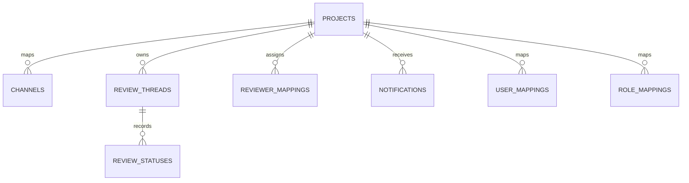

# Database

SQLAlchemy 2 models are persisted in SQLite by default. Alembic revisions
`0001` through `0004` are the only supported schema-management path. Revision
`0004` removes a redundant Discord thread index already supplied by its unique
constraint.

Core tables are `projects`, `channels`, `notifications`, `settings`,
`user_mappings`, `role_mappings`, and `error_logs`. Phase 13/14 adds:

- `projects`: Discord guild/category identity and ACTIVE/ARCHIVED status.
- `channels`: logical channel name and provider-to-channel mapping.
- `review_threads`: provider resource, Discord thread, project, and lifecycle.
- `reviewer_mappings`: unique project/user reviewer assignments.
- `review_statuses`: immutable status history including actor and note.

Project deletion cascades to project-owned mappings and review data. Provider
resource and Discord thread identifiers are uniquely constrained to prevent
duplicate threads. Repository methods own all queries; services use
`session_scope` so success commits and exceptions roll back.

Apply and inspect migrations:

```bash
python -m alembic upgrade head
python -m alembic current
```

Back up the SQLite file configured by `DATABASE_URL` before an upgrade and test
restoration regularly. Do not edit a deployed revision.

## ER diagram


